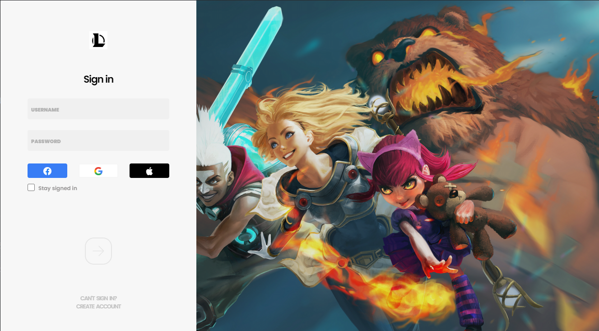

# League of Legends login screen clone

Login screen from version 20.31.2.
Built with [Electron.js](https://www.electronjs.org/)

# Home


# Login



## Project setup

```
yarn install
```

### Compiles and hot-reloads for development

```
yarn electron:serve
```

### Compiles and minifies for production

```
yarn build
```

### Lints and fixes files

```
yarn lint
```

### Customize configuration

See [Configuration Reference](https://cli.vuejs.org/config/).
